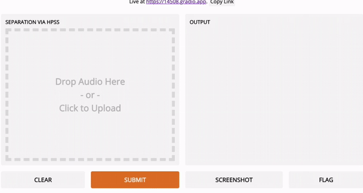

<div align="center">


**Flexible easy-to-use audio source separation**
 
[](https://badge.fury.io/py/nussl)
[](https://pepy.tech/project/nussl)


[](https://codecov.io/gh/nussl/nussl)
[](https://opensource.org/licenses/MIT)

</div>

--------------------------------------------------------------------------------


nussl (pronounced ["nuzzle"](http://www.thefreedictionary.com/nuzzle)) is a flexible, object oriented
Python audio source separation library created by the 
[Interactive Audio Lab](http://music.cs.northwestern.edu/) 
at Northwestern University. It stands for Northwestern University Source Separation Library (or our less-branded backronym: 
"Need Unmixing? Source Separation Library!"). Whether you're a researcher creating novel network architectures or new signal 
processing approaches for source separation or you just need an out-of-the-box source separation model, nussl contains 
everything you need for modern source separation, from prototyping to evaluation to end-use.


# Documentation

Tutorials, code examples, and the API reference are available at the documentation
website which is [available here.](https://nussl.github.io/docs/)


# Features


## Deep Learning

nussl contains a rich feature set for deep learning models, including a 
built in trainer with support for many common datasets in music and speech separation.
nussl also has a External File Zoo where users are able to download pre-trained
models on many different datasets with a number of different configurations. 

### Training Your Own Algorithms

nussl makes it easy to train your own algorithms, with many common architectures,
datasets, and configurations ready-built for many use cases, and an easy way to
extend our built-in functionality for your own needs. There are many pre-built useful
modules that are easy to piece together, such as LSTMs, GRUs, convolutional layers,
fully conneected layers, mask layers, embedding layers. Everything is built on PyTorch, so adding a brand new module is a snap!

### Using Your Own Data

nussl has existing support for many popular source separation datasets, like MUSDB18,
WSJ0, WHAM!, and FUSS. nussl also defines a simple directory structure to add in any data you want.
Want to augment your data? We have support for datasets created with [Scaper](https://scaper.readthedocs.io/en/latest/index.html) built in so you
can train on magnitudes more training data. 

### Downloading Pre-trained Models

Pre-trained models on speech separation, music separation, and more are available
for download at the [External File Zoo (EFZ)](http://nussl.ci.northwestern.edu/),
and there is a built in python API to download models you want from within your code.

## Deep Learning Architectures

We provide the following architectures available out of the box:
* Mask Inference
* Deep Clustering
* Chimera
* OpenUnmix (Soon!)
* TasNet (Soon!)
* DualPath RNN (Soon!)

(See docs for corresponding citations)

## Classical Algorithms

Additionally, nussl also contains implementations of many classical source separation
algorithms, including:

* Spatialization algorithms: DUET, PROJET
* Factorization-based Methods: RPCA, ICA
* Primitive Methods: Repetition (REPET, 2DFT), Harmonic/Percussive, Vocal melody extraction, Timbre clustering
* Benchmark Methods: High Pass filter, Binary Masks, Ratio Masks, Weiner Filtering

## Interaction

nussl supports light interaction via [gradio](https://www.gradio.app/).
To launch a web interface where you can upload audio and hear
separations, simply do:

```python
import nussl

# Make a dummy signal to instantiate object.
dummy_signal = nussl.AudioSignal()

# Create some separation object with desired config.
# This will use the 2DFT algorithm, but since interaction
# is implemented in the base separation object, it is
# available to every algorithm.
ft2d = nussl.separation.primitive.FT2D(dummy_signal)

# Launch the Gradio interface. Use `share=True` to make
# a public link that you can share! Warning - people with
# access to the link will be running code on YOUR
# machine.
ft2d.interact()
```

Or all at once, using `share=True` to create a public link that you can
give to others.

```bash
>>> import nussl
>>> nussl.separation.primitive.HPSS(nussl.AudioSignal()).interact(share=True)
Running locally at: http://127.0.0.1:7860/
This share link will expire in 6 hours. If you need a permanent link, email support@gradio.app
Running on External URL: https://22218.gradio.app
```

This will launch an interface that looks like this:

<div align="center">

</div>

## Evaluation

nussl has many built in evaluation measures to determine how well your algorithm did, including
the museval measure (BSSEvalV4), SI-SDR, SI-SIR, SI-SAR, SD-SDR, SNR, and more! We seek to 
provide a thorough framework for evaluating your source separation research.

# Installation


nussl is on the Python Package Index (PyPI), so it is easy to install with pip:

```
$ pip install nussl
```

**Note: Requires python 3.7+**

For the functionality in ``nussl.play_utils``, you'll want IPython, and ``ffmpeg``, installed as well:

```
$ pip install IPython
$ brew install ffmpeg # on mac
$ apt-get install ffmpeg # on linux
```

To use the Melodia separation algorithm, you'll need to specify this:

```
$ pip install "nussl[melodia]"
```

`vamp` doesn't install on some MacOS versions, so we can't include it by default.
To actually use Melodia, you'll also need the Melodia plugin. For installation
instructions, look [here](https://github.com/justinsalamon/melodia_python_tutorial/blob/master/melodia_python_tutorial.ipynb).


Augmentation effects are applied via either PySox or SoxBindings, if on Linux or MacOS.
`soxbindings` can't be installed from PyPI on Windows, but it may be installable from source.
For source installation instructions, look [here](https://github.com/pseeth/soxbindings). Other
augmentation effects are applied via FFMpeg.

# Citing

If you are using nussl for your research project, we please ask that you cite it using one of the 
following bibtex citations:

    @inproceedings {nussl
        author = {Ethan Manilow and Prem Seetharaman and Bryan Pardo},
        title = "The Northwestern University Source Separation Library",
        publisher = "Proceedings of the 19th International Society of Music Information Retrieval 
            Conference ({ISMIR} 2018), Paris, France, September 23-27",
        year = 2018
    }


# Issues and Contributions

See the [contribution guide](https://nussl.github.io/docs/contributing.html) for
detailed information. But the basics are: bug fixes/enhancements/etc have the standard github
process; but, when adding new algorithms, contributors must provide benchmark files, paper 
references, and trained models (if applicable). Please see the issues page before contacting the authors.

# Contributors

- Prem Seetharaman <http://github.com/pseeth>
- Ethan Manilow <http://github.com/ethman>
- Fatemeh Pishdadian <http://github.com/fpishdadian>
- Nathan Shelly <https://github.com/nathanshelly>
- Andreas Bugler <https://github.com/abugler>
- Bryan Pardo <https://users.cs.northwestern.edu/~pardo/>

Former:

- Corey Grief <http://github.com/cegrief>
- Daniel Felix Kim <http://github.com/DanielFelixKim>
- Ben Kalish <https://github.com/BenKalish42>

nussl's REPET, REPET-SIM implementations are based on MATLAB code from Zafar Rafii. 
The DUET implementation is based on MATLAB code from Scott Rickard. 
nussl's PROJET implementation is based on python code from Antoine Liutkus.

See documentation and inline comments for each algorithm for more information about citations and authorship.

## Acknowledgements

We'd like to also thank Jonathan Le Roux and Gordon Wichern for very helpful discussions 
throughout the development of this package! 

# License

nussl 1.0 is under an [MIT License](https://opensource.org/licenses/MIT)

The MIT License (MIT)

Copyright (c) 2016-2020 Interactive Audio Lab

Permission is hereby granted, free of charge, to any person obtaining a copy of this software and 
associated documentation files (the "Software"), to deal in the Software without restriction, 
including without limitation the rights to use, copy, modify, merge, publish, distribute, 
sublicense, and/or sell copies of the Software, and to permit persons to whom the Software is
furnished to do so, subject to the following conditions:

The above copyright notice and this permission notice shall be included in all copies or 
substantial portions of the Software.

THE SOFTWARE IS PROVIDED "AS IS", WITHOUT WARRANTY OF ANY KIND, EXPRESS OR IMPLIED, INCLUDING BUT
NOT LIMITED TO THE WARRANTIES OF MERCHANTABILITY, FITNESS FOR A PARTICULAR PURPOSE AND 
NONINFRINGEMENT. IN NO EVENT SHALL THE AUTHORS OR COPYRIGHT HOLDERS BE LIABLE FOR ANY CLAIM, 
DAMAGES OR OTHER LIABILITY, WHETHER IN AN ACTION OF CONTRACT, TORT OR OTHERWISE, ARISING FROM, 
OUT OF OR IN CONNECTION WITH THE SOFTWARE OR THE USE OR OTHER DEALINGS IN THE SOFTWARE.
